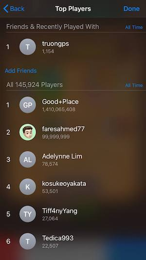

# realbizgames-userplayingdata-highscore

***Goals:***
1. One place to control all user high score data.
2. User high-score can be sent to Google Play Leader Board or GameCenter Leader Board.
3. It can be config to use which place that the developer want to store the score.
  
  
## Configuration
1. USING_HIGHSCORE_UNITY_SOCIAL : Use Unity IAP to Report Score and Show Leader Board UI

  
  
## IOS GameCenter Leader Board
1. https://developer.apple.com/design/human-interface-guidelines/game-center/overview/leaderboards/
2. https://docs.unity3d.com/ScriptReference/SocialPlatforms.GameCenter.GameCenterPlatform.html

  
## Android Google Play Service Leader Board
1. https://github.com/playgameservices/play-games-plugin-for-unity

> The Google Play Games plugin for Unity allows you to access the Google Play Games API through Unity's social interface. The plugin provides support for the following features of the Google Play Games API:
>
> sign in.
>  
> friends. 
> 
> unlock/reveal/increment achievement. 
> 
> post score to leaderboard
> 
> cloud save read/write
> 
> show built-in achievement/leaderboards UI
> 
> events
> 
> video recording of gameplay
> 
> nearby connections

# Reference
